# Development of BiopotentailHID(Human Interface Device)

### このプロジェクトで目指しているHumanInterfaceDeviceの特徴

* 脳波(EEG)もしくは筋電位(EMG)と使って入力のインターフェースを目指していること
* 一般のPC・スマホでも使えるようにデバイスの開発をめざしていること

### このプロジェクトの開発の特徴

* 個人購入可能な部品でデバイス設計を進めること
* 定例開発会議を開いて積極的に開発をすすめること(現在計画中です)

# 開発プロジェクトへの参加

→[プロジェクトの参加方法](/Doc/HowToEntry.md)

# リポジトリの構造・利用方法

→[プロジェクトの利用方法](/Doc/README.md) 

# 現在の開発目標1：EMGによる1CHのキーボード入力デバイス

現在の開発目標の一つ目は、EMGによる1CHのキーボード入力デバイスの開発です。
このプロジェクトのBiopotentialによるHID開発の基礎となる技術の開発を進めています。

# 現在の開発目標2：プロジェクト利用・開発プロセスの明文化

開発目標の二つ目は、プロジェクト利用・開発プロセスの明文化です。

* ①「プロジェクト利用について」のドキュメント
ここで公開されているリポジトリをもとに、どのようにデバイスを作製していくのかなど

* ②「開発プロセスについて」のドキュメントの作製
どのような形態で開発を進めているのかや定例開発会議、プロジェクト開発、プロジェクトへの参加のの方法など

# 直近の開発進捗

直近では、1CHの筋電総服増幅アンプを作成しました。
この資料も随時共有していきたいと考えています。

資料は、このGithubでも整備していく予定ですが、取り急ぎとしてScrapBoxにも上げています。

[ScrapBoxリンク (BiopotentialMemos)](https://scrapbox.io/BiopotentialMemos/ )

---

# 最終目標

このプロジェクトの夢は、アニメ*ソードアートオンライン*のような、EEGによる **"アバターフルコントロールデバイス"** を実現させられればいいなと思っています。そのほか、ハンドフリーでスマートフォンを操作したり、VRとの連携であったりなど、可能性の多いデバイスになることを期待しています。

# 大目標

体電位(EEG:脳波 or EMG:筋電位)でマウスやキーボードのようなのHID(Human Interface Device) を作ること

※その後の行先はまだいくつもの可能性があって、いかようにもデザインできます。ぜひ議論を深めたい。

# このブロジェクトのモチベーション.

たぶん、みんなこういうの絶対欲しいと思ってるし(少なくとも日本では、少なくとも私は！)、「開発してやろうじゃないか！」って人は多分少なくないとおもいます。

でも「脳波？ってどうやれば測定できるの？」とか、「脳波ってなに？」とか、「信号処理はできるけどデバイスは作れない」とか、「デバイスは作れるけど、情報処理がわからない」とか、「そもそも全部わらかんけどやりたい！」って人もいると思っています。

そんな熱い開発魂、開拓魂、希望をもつ人が同じ目標をむいて、発展させていくためにこのプロジェクトを作成しました。

[more opensource reason ->](Doc/OpensourceReason.md)

### ***「まずはこの分野を知見をもっとオープンに」  「もっと体系的に・網羅的に」  「だれでもわかりやすい資料を」  を心がけたリポジトリを目指しています*** 

EEG( or EMG)デバイスの開発はそれ自体が特性上、複合分野の知識・技術が要求されます。(人体、脳科学、生理学、バイオ、センサ、筐体設計、アナログ回路、組み込み系、デジタル信号処理、特徴抽出、AI、通信規格、etc...)

上記でもわかるとおり、脳科学から...医療...バイオ...組み込みデバイス...通信規格まで包括的な技術分野を跨いでいるのがEEG(/EMG)デバイスという分野。そのため *「ソードアートオンラインみたいなの作りたい！」* を、技術の全体像が見えず、あきらめることも多いと思います。

だからこそのOpenSourceプロジェクト＝ ***「まずはこの分野を知見をもっとオープンに」*** であり、興味のある人がみんなと協力できるための ***「だれでもわかりやすい資料を」*** を、EEG(EMG)HIDの開発という目標を通して蓄積・共有・成長させていきたいのです。
