# Development of BiopotentailHID(Human Interface Device)

# The Project's Dream !!!

The Project's Dream is realize **"Avatar Full Controlling Device"** by using EEG Device like Anime *Sword Art Online* . I want the world where the EEG device is commonplace to spread...

このプロジェクトの夢は、アニメ*ソードアートオンライン*のような、EEGによる **"アバターフルコントロールデバイス"** を実現させることです。そんなEEGデバイスが当たり前の世の中が広まることです!!!

left image from https://id.pinterest.com/pin/133067363968527540/
right image from image from https://www.pinterest.co.uk/pin/654359020838515059/

# このブロジェクトの存在理由.

たぶん、みんなこういうの絶対欲しいと思ってるし(少なくとも日本では、少なくとも私は！)、「開発してやろうじゃないか！」って人は多分少なくないとおもいます。

でも「脳波？ってどうやれば測定できるの？」とか、「脳波ってなに？」とか、「信号処理はできるけどデバイスは作れない」とか、「デバイスは作れるけど、情報処理がわからない」とか、「そもそも全部わらかんけどやりたい！」って人もいると思っています。

そんな熱い開発魂、開拓魂、希望をもつ人が同じ目標をむいて、発展させていくためにこのプロジェクトを作成しました。

## なんでオープンソース？

そもそもだれかが独占する技術じゃない！　独占しようとするから技術を隠蔽いつまでたってもEEGデバイス発展しない！　商用利用までいかない！　EEGデバイスのゲームがでてこない！　遊べない！ ってことだと思ってます(これは持論ですし、このあともしばらく持論です(笑))

### ***商用目的の開発はまだ早すぎる***

この分野がたびたび期待を集めるにも関わらず、一般にこの分野の技術を使った製品が発売されない一番の原因は、単純に「分野に活気がない」からだと思っています。

#### 生品を開発する、民間企業は活気がない技術分野の製品には手をつけられない?
* 前例がない
    * 収益が見通せない
    * 企画担当：そもそも何ができんの?
    * 開発スケジュールが見通せない
* わかる人がいない
* 製品を作ったとしても、技術を社外秘にしてしまい分野が発展しない

がんばって製品を作り出すにしても、一般に体系的な知識や技術が共有されていないため、製品企画・仕様作成・開発の全てを難しいものにしています。そのため工数も予算もいくらあっても着実は収益になるかは見通すことが難しいと考えています。

### 研究自体は活発。しかし...
とても魅力的な分野だけあり、脳科学や、BMI(Brain Machine Interface)/BCI(Brain Computer Interface)、筋電義手など学術研究研究はとしても盛んな印象をうけます。しかし...
* 知識や技術が公開されにくい (やれ会員だなんだ、金がいるだ、著作権だ..)
* 学術的に価値のある方向にしか発展しない (みんなの実現したい！からはズレがある)
* 単発的(局所的)な参考資料しか調べても見つからない
* 研究成果・客観性が目的になっているため、誰にでもわかりやすいという観点ではない
* 研究目的で製品化までの時間が長い
    * 製品化されたところで、技術が世の中に全て公開されることはない
    * 収益のために社外秘にすることが多い

→ 共通していえることは、学術研究でも民間でも、技術が一般に広まることが少ない。
→ ただでさえも活気がないのに、いまそれをやってしまっても、技術の局所化・隠蔽化・高度な専門性だけが進んでいく一方...

### ***「まずはこの分野を知見をもっとオープンに」  「もっと体系的に・網羅的に」  「だれでもわかりやすい資料を」*** 

EEG( or EMG)デバイスの開発はそれ自体が特性上、複合分野の知識・技術が要求されます。(人体、脳科学、生理学、バイオ、センサ、筐体設計、アナログ回路、組み込み系、デジタル信号処理、特徴抽出、AI、通信規格、etc...)

上記でもわかるとおり、脳科学から...医療...バイオ...組み込みデバイス...通信規格まで包括的な技術分野を跨いでいるのがEEG(/EMG)デバイスという分野。そのため *「ソードアートオンラインみたいなの作りたい！」* を、技術の全体像が見えず、あきらめることも多いと思います。

だからこそのOpenSourceプロジェクト＝ ***「まずはこの分野を知見をもっとオープンに」*** であり、興味のある人がみんなと協力できるための ***「だれでもわかりやすい資料を」*** を、EEG(EMG)HIDの開発という目標を通して蓄積・共有・成長させていきたいのです。

そして分野の技術がわかる人が増えれば、民間での開発も、学術研究もさかんに、もっとハイレベルで行われは、「It'a KIRITO's Device！！」が現実になる日も近いでしょう (笑)

そんな夢を見る、開発者・Dreamerが力を合わせてこの分野を発展させる小目標として ”Biopotential にるよる HIDの開発” というマイルストーン(このプロジェクト(このリポジトリ))を捧げます。

It'a KIRITO's Device！！」までいかなくても、"Biopotential(EEG) による HIDの開発(Keyboard&Pointing)"がオープンソースとして成功すれば、「iPhoneを脳波で操作するのが当たり前」の世界も近いと思います(笑)

# The Project's Goal.

改めて、このプロジェクトの(=リポジトリ)の当面の目標は、

体電位(EEG:脳波 or EMG:筋電位)でマウスやキーボードのようなのHID(Human Interface Device) を作ることです。

※その後の行先はまだいくつもの可能性があって、いかようにもデザインできます。ぜひ議論を深めたい。

# The Project's Current Goal.

そして当面の目標のためのさらに小さな目標は、EMGによる1CHのキーボード入力デバイスです。

# in current...

直近では、1CHの筋電総服増幅アンプを作成しました。
この資料も随時共有していきたいと考えています。

資料は、このGithubでも整備していく予定ですが、取り急ぎとしてScrapBoxにも上げています。

[ScrapBoxリンク (BiopotentialMemos)](https://scrapbox.io/BiopotentialMemos/ )

